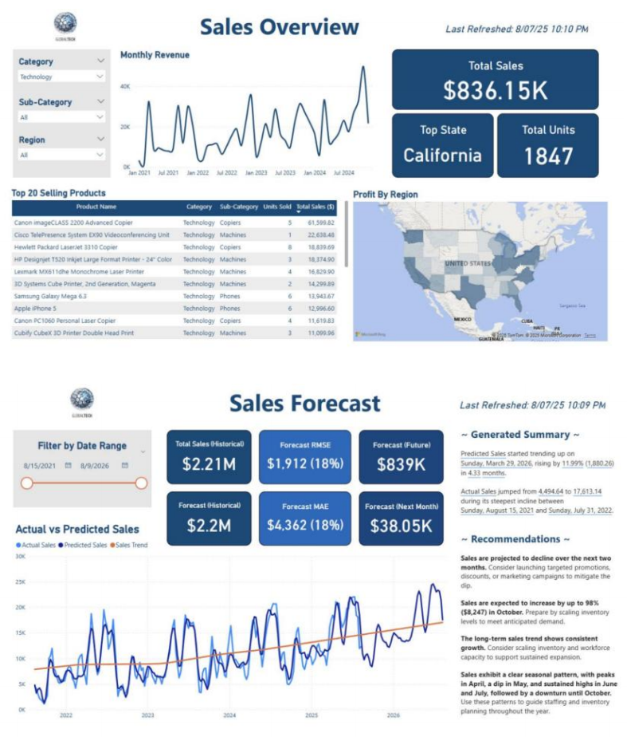

Developed a cohesive decision support
tool integrating historical sales analysis with future sales forecasting. The system
provides executive leadership with
summaries of product performance
across regions and categories, demand
patterns and revenue trends, and future
sales performance forecasts. This allows evidence-based decisions to be made
regarding company resource allocation
and market strategy.

    

